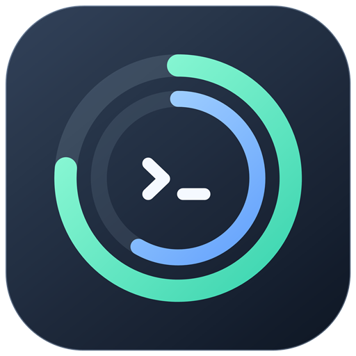

# Codex Quota Widget



轻量 Windows 桌面额度组件。使用本机 Codex CLI 的官方 app-server 接口，显示当前 ChatGPT 账号的 Codex 短期和每周剩余额度。

## 功能

- 236×158 逻辑像素的半透明圆角卡片，双环显示剩余额度。
- 默认每 60 秒刷新，支持手动刷新、拖动、置顶和托盘隐藏。
- 鼠标悬停额度环可查看重置时间；右键可调整透明度和自启。
- 网络故障自动重连并逐步延长重试间隔；旧数据会明确标记。
- 不调用模型，不创建对话，不需要另填 API Key。

## 下载和运行

从本仓库 [Releases](../../releases/latest) 下载 `CodexQuota-v1.0.0-windows.zip`，完整解压到有写入权限的固定目录。

运行环境：Windows 10/11、.NET Framework 4.7.2 或更新版本，以及已安装并使用 ChatGPT 账号登录的 Codex CLI。程序优先查找当前用户 npm 全局安装的 CLI，其次查找 PATH 中的 `codex.exe`。

1. 在终端确认 `codex --version` 可用，并通过 `codex login` 完成登录。
2. 双击 `CodexQuota.exe` 启动；也可双击 `Start.vbs` 创建桌面快捷方式并启动。
3. 首次启动默认启用当前用户登录 Windows 后自启，可在组件右键菜单中关闭。自启快捷方式位于当前用户的 Windows 启动文件夹。

请保留解压目录，快捷方式会引用其中的程序和图标。程序未进行代码签名。

## 使用

| 操作 | 效果 |
| --- | --- |
| 拖动卡片 | 移动并记住位置 |
| 点击右上角 ↻ 或双击卡片 | 立即刷新 |
| 悬停额度环 | 查看该额度的重置时间 |
| 右键卡片 | 连接详情、透明度、置顶、自启、隐藏、退出 |
| 再次运行程序或双击托盘图标 | 唤回已有窗口 |

“剩余百分比”是 `100 - usedPercent`，不是 token 数量。缺失额度显示为“—”；查询失败时不推算或伪造新额度。数据以 CLI 当前登录账号为准，服务端可能有延迟。

## 网络和认证

使用持续运行的 `codex app-server`，通过 `account/rateLimits/read` 查询。认证交给官方 CLI；认证错误时请求 CLI 刷新登录。应用不读取、复制或保存认证令牌。

优先使用显式代理环境变量，否则读取 Windows 的手动 HTTP 代理设置。普通连接错误按 15、30、60、120、240、300 秒重试；HTTP 429 会延长等待。可在右键“额度与连接详情”查看脱敏后的错误信息。持续的网络故障、登录过期或服务端异常仍需要相应处理。

官方协议文档：[Codex App Server](https://learn.chatgpt.com/docs/app-server)。

## 从源码构建

无需第三方 NuGet 包；使用 Windows 自带的 .NET Framework C# 编译器。

```powershell
# 在仓库根目录运行，构建前先退出该目录中的组件
.\Build.ps1

# 运行错误分类、退避、额度解析和脱敏回归检查
.\tests\Test.ps1
```

`tools/MakeQuotaIcon.ps1` 可在 Windows PowerShell 5.1 中重新生成多尺寸 ICO 和 PNG 图标。

## 本地数据

应用目录会生成 `settings.json`、`quota-cache.json`、`widget-status.json`、`widget.log` 和 `runtime/`。它们包含本地设置、额度缓存或运行状态，已列入 `.gitignore`，不随发布包上传。请勿手动提交这些文件。

首次发布已验证 Windows 桌面显示、实际额度查询、周期刷新、网络失败后恢复、图标加载及自启入口；12 项回归检查通过。未通过重启电脑专门验证自启流程。

卸载前在右键菜单关闭自启，然后退出程序并删除应用目录与桌面快捷方式。

这是独立桌面工具，与 OpenAI 官方没有隶属关系。
